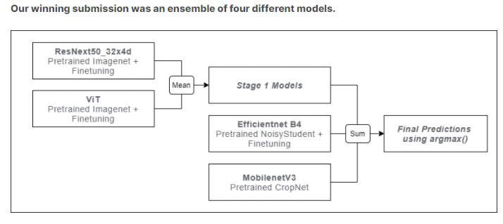

# Casava_Ensemble_FollowUp
--------------

  

Implementation of a Casava Ensemble Model from scratch

Using "Ensemble" is the most important technique to 🚀 accuracy

Here is simple example for mnist ensemble

  

## Mnist-Ensemble-Test   

The testing `git-hub-link` is mnist for 

:one: RandomForest

:two: DNN

:three: CNN 

  

##  [Kaggle 1st Solution](https://www.kaggle.com/c/cassava-leaf-disease-classification/discussion/221957)

-----------

1. Create Data Utilties 
    - Data Download
    - Data preprocessing
    - Data Augmentation

2. Create Config to manage variety architecture
    - Each architecture includes differenct config

3. Train Each Architectures
    - Each model should be stored with model config and data config

    -------
    ###  | Requires to add colab link |
    The colab is not Opened Yet < : smile : >
    ------
    | Model | Colab |
    |---|---|
    |ResNet||
    |ViT||
    |Efficientnet B4||
    |Mobilenet V3||

4. Try do "Ensemble" with following the 1st solution

5. Create Pipeline as consider as Operation perspective

6. Create Demo Pages with web page

7. Create Docker File to test the repository

